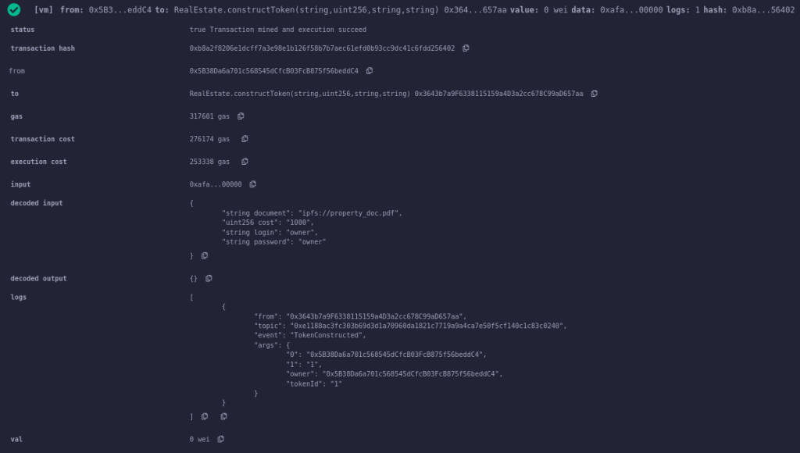
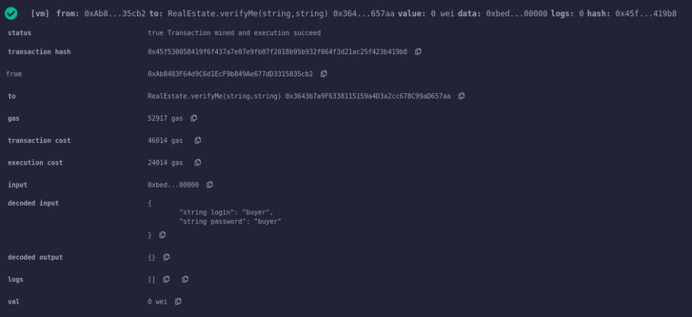
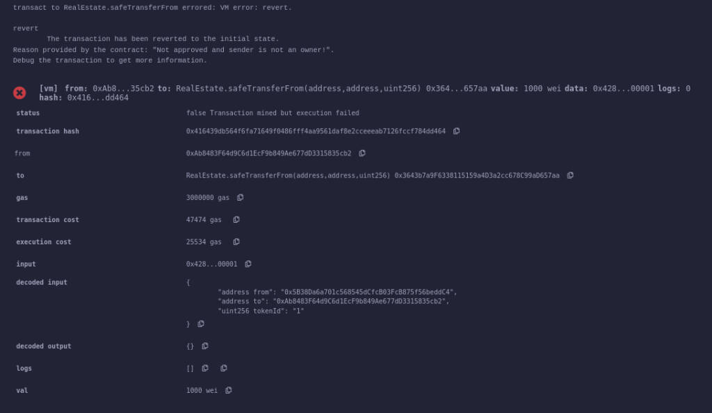
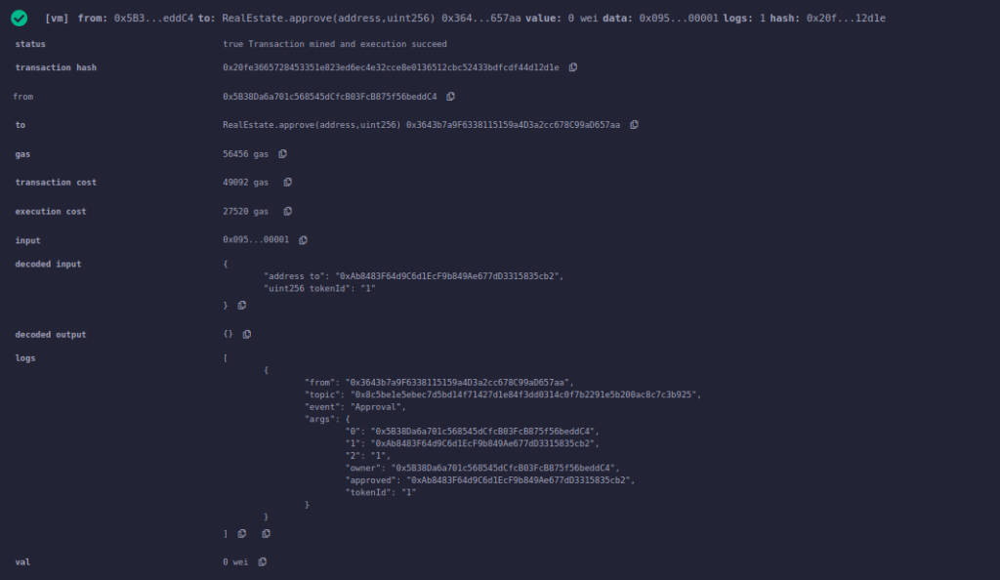
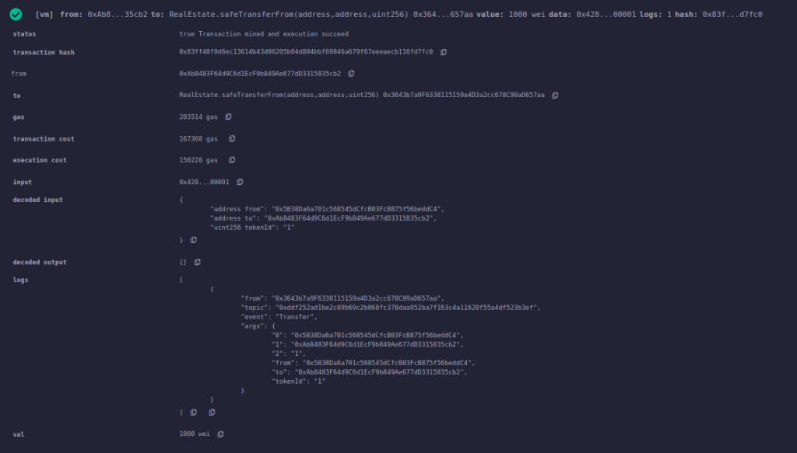
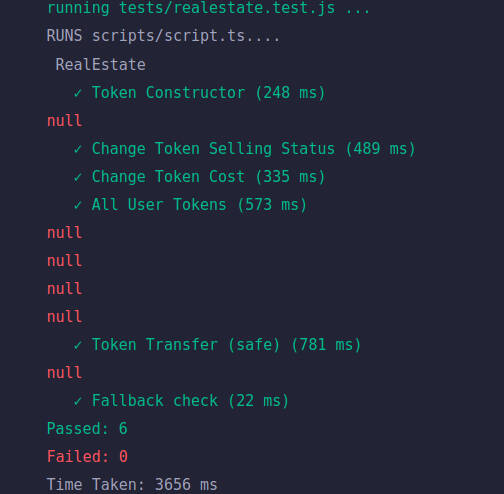

# Smart Contract

Задание №1. Блокчейн. НИТУ МИСиС весна 2023.

## Бизнес-логика

> Назначение смарт-контракта, представленного в репозитории, -- регулирование купли-продажи недвижимости с использованием технологии блокчейн.  

Владельцы недвижимости могут выставить на продажу ***своё*** имущество, зарегистрированное в [Росреестре][rosreestr], в виде **невзаимозаменяемого токена**. Для проведения транзакции каждый пользователь обязан верифицироваться с использованием аккаунта на портале [Госуслуг РФ][gosuslugi]. Любой *верифицированный* пользователь (кроме самого владельца) может подать запрос на приобретение недвижимости. В случае одобрения покупки со стороны продавца происходит автоматический перевод денежных средств (криптовалюты) на кошелёк покупателя, а право владения токена, который является цифровым представлением имущества, переходит к покупателю.

## Мотивация

Купля-продажа недвижимости сопровождается большими затратами - материальными, временными и моральными - как для продавца, так и для покупателя. Это происходит по многим причинам:

- покупатель и продавец не хотят быть обманутыми и часто обращаются к третьей стороне для проведения сделки;
- покупатель и продавец часто не разбираются в данной области достаточно хорошо, чтобы проследить за правильностью юридического процесса, и во избежание трудностей в будущем обращаются к юристам;
- регистрация перехода права на недвижимость от продавца к покупателю занимает от 5 до 90 рабочих дней и только после того, как регистратор Росреестра внесет запись в Единый государственный реестр недвижимости (ЕГРН) о переходе права, покупатель станет полноправным собственником.

Использование технологии блокчейна в данной предметной области поможет облегчить процесс купли-продажи недвижимости, так как все необходимые операции произвядтся автоматически при помощи смарт-контракта:

- для соблюдения всех норм и правильного составления договора не требуется найм юристов или обращение в специализирующиеся компании;
- не нужно полагаться на такие централизованные организации как банки для гарантии безопасности;
- сокращённое время ожидания заключения сделки;
- повышенная безопасность - сделка пройдёт только в том случае, если выполнены необходимые условия, а значит обе стороны заинтересованы играть по-чесному;
- простота вхождения - человеку необходимо только пройти верификацию, а все сложности смарт-контракт возьмёт на себя;
- прозрачность владения - все транзакции записаны в блокчейн, а значит видна полная история купли-продажи недвижимости и возможно получение достоверных данных о владельце.

## Алгоритм купли-продажи  

На примере продажи Здания А, инициированной Продавцом (с адресом в блокчейне `0x5B3...dC4`), рассмотрим алгоритм действий Покупателя (с адресом в блокчейне `0xAb8...cb2`).  

#### Нулевой шаг

Создание токена (цифрового представления имущества) инициируется Продавцом, который проводит транзакцию, например, со следующими параметрами:
```cpp
// документ на имущетсво, стоимость (вей), логин (Госуслуги), пароль (Госуслуги)
constructToken("ipfs://property_doc.pdf", 1000, "owner", "owner") 
```
В случае успешной транзакции будет выведено сообщение следующего вида  


#### Первый шаг

Для покупки недвижимости Покупатель обязан пройти этап верификации (например, со следующими параметрами):
```cpp
// логин (Госуслуги), пароль (Госуслуги)
verifyMe("buyer", "buyer")
```
В случае успешной транзакции будет выведено сообщение следующего вида  


#### Второй шаг

После выбора интересующей Покупателя недвижимости, необходимо запросить (каким-либо образом) разрешение на покупку у Продавца, иначе при попытке купить имущество 
```cpp
// адрес Продавца, адрес Покупателя, номер токена (недвижимости) в блокчейне 
safeTransactionFrom(0x5B3...dC4, 0xAb8...cb2, 1)
```
будет выведено сообщение следующего вида  


Продавец может выдать согласие на покупку следющим образом:
```cpp
// адрес Покупателя, номер токена (недвижимости) в блокчейне 
approve(0xAb8...cb2, 1)
```
вывод  


После получения одобрения на покупку Покупатель может приобрести токен (недвижимость)
```cpp
// адрес Продавца, адрес Покупателя, номер токена (недвижимости) в блокчейне 
safeTransactionFrom(0x5B3...dC4, 0xAb8...cb2, 1)
```
результат транзакции


## Запуск

Для тестирования корректной сборки проекта, пожалуйста, запустите тесты `realestate.test.js`. При корректной сборке результат будет как на фото ниже


## Авторы 

Клейменов А.А., МПИ-22-1
Толстенко Л.С., МПИ-22-1

[//]: # (links)
[rosreestr]: <https://rosreestr.gov.ru>
[gosuslugi]: <https://www.gosuslugi.ru>
